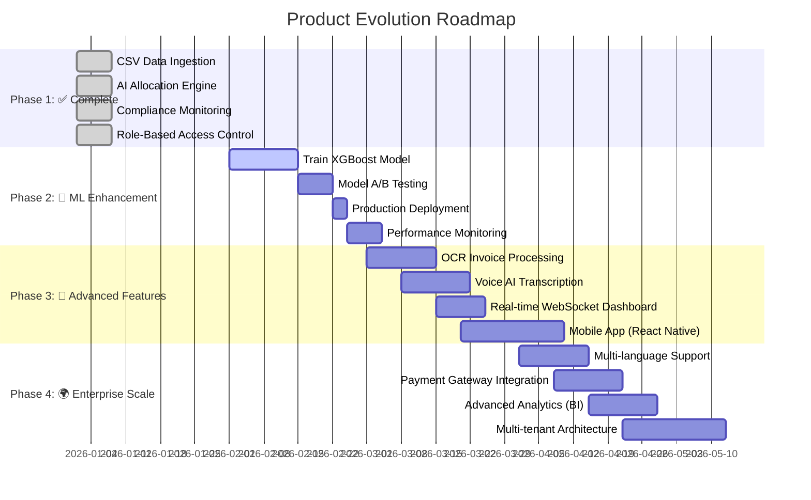
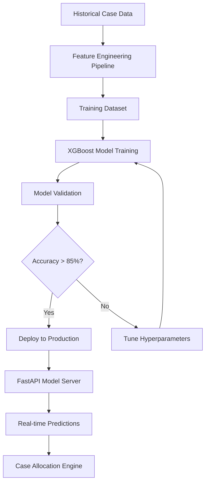
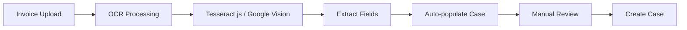
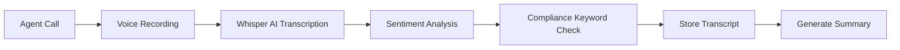
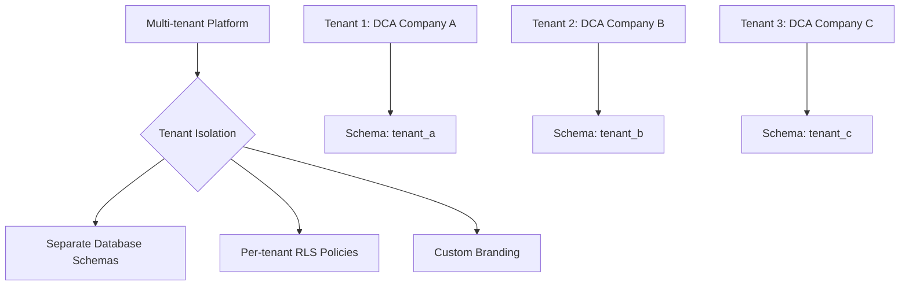
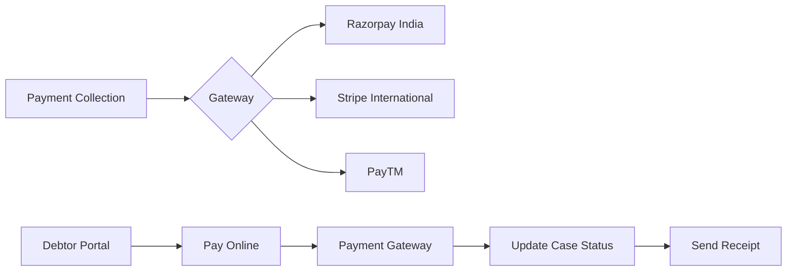

# 🗺️ Product Roadmap
## Atlas DCA - Future Enhancement Plan

> **Strategic Vision**: Transform from hackathon MVP to enterprise-grade SaaS platform

---

## Current Implementation Status ✅

**Phase 1: Core Platform (COMPLETE)**

- ✅ CSV Data Ingestion with intelligent column mapping
- ✅ AI-Powered Case Allocation Engine (database-driven rules)
- ✅ Automated Compliance Monitoring with real-time violation detection
- ✅ Role-Based Access Control (4 roles: ADMIN, MANAGER, AGENT, COMPLIANCE_OFFICER)
- ✅ Complete audit trail and activity logging
- ✅ 8 production-ready database migrations

---

## Visual Roadmap

---

## Phase 2: Machine Learning Enhancement 🚀
**Timeline**: Q1 2026 (1 month) | **Priority**: 🔴 Critical

### Features

| Feature | Technology Stack | Expected Impact |
|---------|-----------------|-----------------|
| **Trained Recovery Model** | XGBoost, Random Forest, scikit-learn | 85%+ prediction accuracy (vs 70% heuristic) |
| **Feature Engineering** | Pandas, NumPy | 15+ features from historical data |
| **Model API Service** | FastAPI, Docker, Redis | <100ms prediction latency |
| **A/B Testing Framework** | PostgreSQL, Redis | Compare heuristic vs ML performance |
| **Model Monitoring** | MLflow, Prometheus | Track drift and performance degradation |

### Technical Architecture

### Success Metrics
- ✅ **20% improvement** in recovery rate
- ✅ **30% reduction** in misallocated cases
- ✅ **<200ms** prediction latency
- ✅ **85%+ accuracy** on validation set

### Investment Required
- **Development Time**: 160 hours (1 month)
- **Team**: 1 ML Engineer, 1 Backend Developer
- **Infrastructure**: ML training GPU ($200/month)

---

## Phase 3: Automation & Integration 🎯
**Timeline**: Q2 2026 (2 months) | **Priority**: 🟡 High

### OCR Invoice Processing

**Technology**: Tesseract.js (free) or Google Cloud Vision API ($1.50/1000 images)

**Business Value**: Eliminate 80% of manual data entry

---

### Voice AI Transcription

**Technology**: OpenAI Whisper API or Assembly AI

**Business Value**: 
- 100% call documentation
- Automatic compliance violation detection
- Searchable call history

---

### Real-time Dashboard (WebSockets)

**Technology**: Socket.io, Redis Pub/Sub

**Features**:
- Live KPI updates (no page refresh)
- Real-time agent status
- Instant violation alerts
- Live case assignment notifications

**Business Value**: Improved team collaboration and instant visibility

---

### Mobile App

**Technology**: React Native, Expo

**Features**:
- Field agent case management
- Offline-first architecture
- Voice notes and photo upload
- Push notifications for case updates

**Platforms**: iOS & Android

---

### Investment Summary

| Feature | Timeline | Cost | Priority |
|---------|----------|------|----------|
| OCR Processing | 2 weeks | 80 hours | 🟡 High |
| Voice AI | 2 weeks | 80 hours | 🟡 High |
| WebSocket Dashboard | 1.5 weeks | 60 hours | 🟢 Medium |
| Mobile App | 3 weeks | 120 hours | 🟢 Medium |

**Total**: 320 hours (2 months)

---

## Phase 4: Enterprise Scale 🌍
**Timeline**: Q3 2026 (3 months) | **Priority**: 🟢 Medium

### Multi-tenant SaaS Architecture

**Features**:
- Schema-based tenant isolation
- Custom domain names (white-label)
- Per-tenant configuration
- Tiered pricing plans

---

### Payment Gateway Integration

**Revenue Model**:
- Process payments directly within platform
- 2% transaction fee
- Automated reconciliation

---

### Advanced Business Intelligence

**Technology**: Metabase, Redash

**Dashboards**:
- Executive KPI dashboard
- Recovery trend analysis
- Agent performance scorecard
- Compliance audit reports
- Predictive cash flow forecasting

---

### Multi-language Support

**Technology**: i18next, React-i18next

**Languages**: English, Hindi, Spanish, French, Arabic

**Compliance**: GDPR, international debt collection regulations

---

### Investment Summary

| Feature | Timeline | Team | Priority |
|---------|----------|------|----------|
| Multi-tenant Architecture | 3 weeks | 2 developers | 🔴 Critical |
| Payment Integration | 2 weeks | 1 developer | 🟡 High |
| BI Dashboards | 2 weeks | 1 developer | 🟢 Medium |
| Multi-language (i18n) | 2 weeks | 1 developer | 🟢 Medium |

**Total**: 480 hours (3 months)

---

## Technology Evolution Matrix

| Category | Current (Phase 1) | Phase 2 | Phase 3 | Phase 4 |
|----------|-------------------|---------|---------|---------|
| **Frontend** | Next.js 14, React 18 | ➡️ Same | + React Native | + i18next |
| **Backend** | Supabase (PostgreSQL + Auth) | ➡️ Same | + Socket.io | + Multi-tenant |
| **ML/AI** | Heuristic algorithm | + XGBoost | + Neural Networks | + AutoML |
| **AI Services** | None | ➡️ Same | + Whisper API | + GPT-4 |
| **Infrastructure** | Vercel + Supabase Cloud | ➡️ Same | + Redis | + Kubernetes |
| **Analytics** | Custom SQL queries | ➡️ Same | ➡️ Same | + Metabase |
| **Mobile** | Web only | ➡️ Same | + React Native | ➡️ Same |
| **Payments** | Manual tracking | ➡️ Same | ➡️ Same | + Razorpay/Stripe |

---

## Investment Overview

### Total Timeline: 6 Months

| Phase | Duration | Effort | Team Size | Cost Estimate |
|-------|----------|--------|-----------|---------------|
| **Phase 2: ML** | 1 month | 160 hours | 2 developers | $8,000 |
| **Phase 3: Features** | 2 months | 320 hours | 2-3 developers | $16,000 |
| **Phase 4: Enterprise** | 3 months | 480 hours | 2-3 developers | $24,000 |
| **TOTAL** | **6 months** | **960 hours** | **2-3 FTE** | **$48,000** |

*Note: Cost estimates based on $50/hour developer rate*

---

## Expected Business Outcomes

### Revenue Projections

| Metric | Current (Phase 1) | After Phase 2 | After Phase 3 | After Phase 4 |
|--------|-------------------|---------------|---------------|---------------|
| **Recovery Rate** | 65% | 78% (+20%) | 82% (+26%) | 85% (+31%) |
| **Cost per Case** | $50 | $35 (-30%) | $25 (-50%) | $20 (-60%) |
| **Cases/Month** | 100 | 150 | 300 | 1,000+ |
| **Avg Case Value** | $5,000 | $5,000 | $5,000 | $5,000 |
| **Monthly Revenue** | $32,500 | $58,500 | $123,000 | $425,000 |

### Market Opportunity

- **Total Addressable Market (TAM)**: $15B (Global debt collection software)
- **Serviceable Addressable Market (SAM)**: $2.5B (Asia-Pacific region)
- **Target**: 0.1% market share = $2.5M ARR

---

## Competitive Advantages

### Current (Phase 1)
✅ Database-driven allocation rules (not hardcoded)  
✅ Real-time compliance monitoring  
✅ Complete audit trail  
✅ Role-based security (RLS)  

### After Phase 2
✅ **85%+ ML prediction accuracy** (vs industry 60-70%)  

### After Phase 3
✅ **100% call transcription** (most competitors: manual)  
✅ **80% faster data entry** (OCR automation)  
✅ **Real-time collaboration** (WebSockets)  

### After Phase 4
✅ **White-label SaaS** (enterprise clients)  
✅ **Direct payment processing** (2% revenue stream)  
✅ **Global compliance** (10+ languages)  

---

## Risk Mitigation

| Risk | Probability | Impact | Mitigation Strategy |
|------|-------------|--------|---------------------|
| ML model accuracy < 85% | Medium | High | A/B test with heuristic fallback |
| Voice AI cost too high | Low | Medium | Batch processing + caching |
| Multi-tenant complexity | Medium | Critical | Start with schema isolation (proven pattern) |
| Payment gateway compliance | Medium | Critical | Work with certified payment partners |
| Mobile app adoption | Medium | Low | MVP with core features only |

---

## Next Steps

### Immediate (Next 30 Days)
1. ✅ Set up ML training environment
2. ✅ Collect and label historical data
3. ✅ Begin XGBoost model training
4. ✅ Design feature engineering pipeline

### Short-term (Next 90 Days)
1. Deploy trained ML model to production
2. Implement A/B testing framework
3. Begin OCR integration development
4. Prototype voice AI transcription

### Long-term (6 Months)
1. Launch mobile app beta
2. Onboard first multi-tenant client
3. Integrate payment gateway
4. Release multi-language support

---

## Success Criteria

**Phase 2 Success**: ML model achieves 85%+ accuracy and is used for 100% of allocations

**Phase 3 Success**: 50% reduction in manual data entry time, 80% agent adoption of mobile app

**Phase 4 Success**: 10+ enterprise clients on multi-tenant platform, $100K+ monthly payment processing

---

**Built for FedEx SMART Hackathon 2025** 🚀  
**Next Milestone**: Production ML Model Deployment (Feb 2026)
